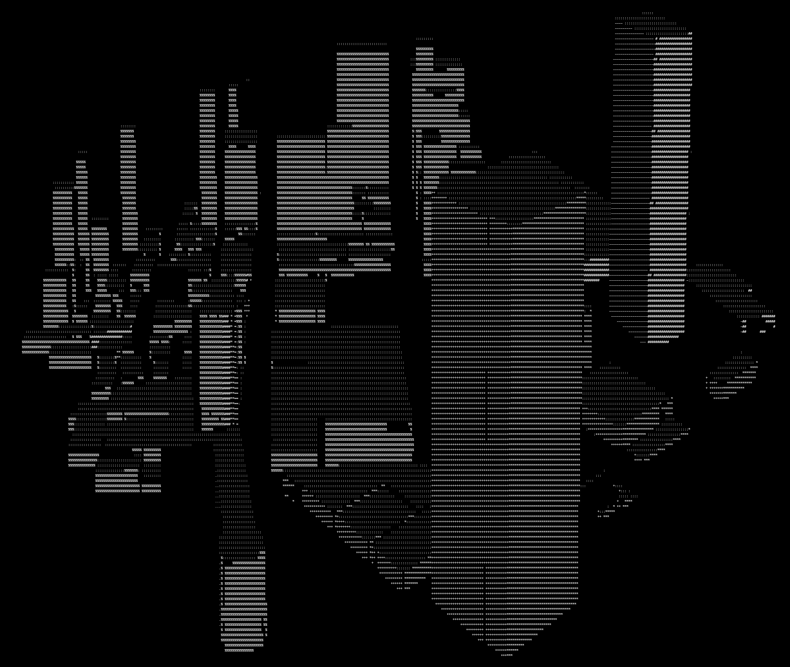
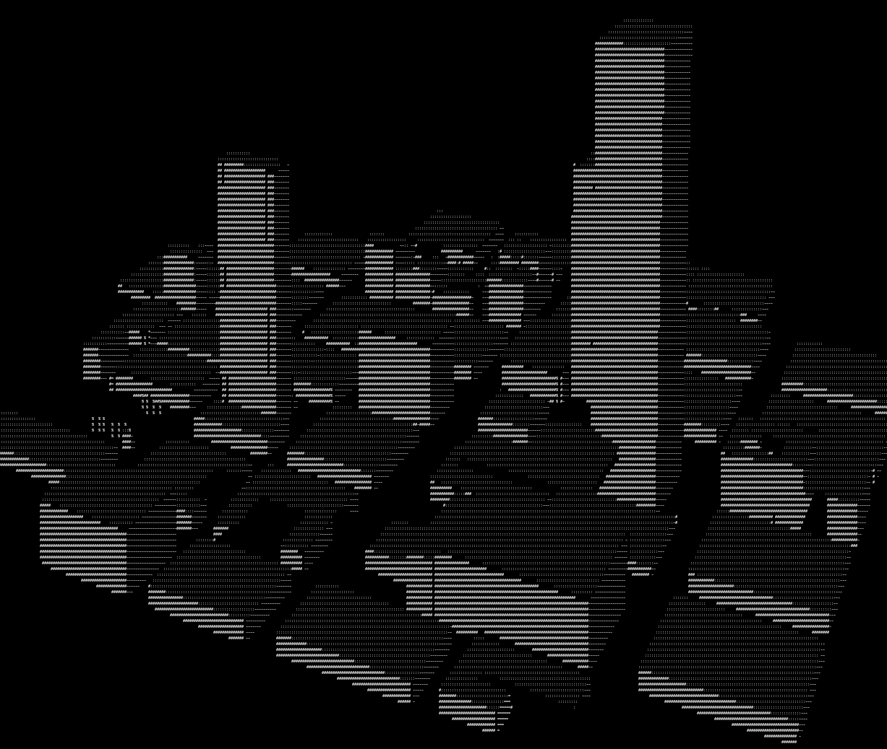
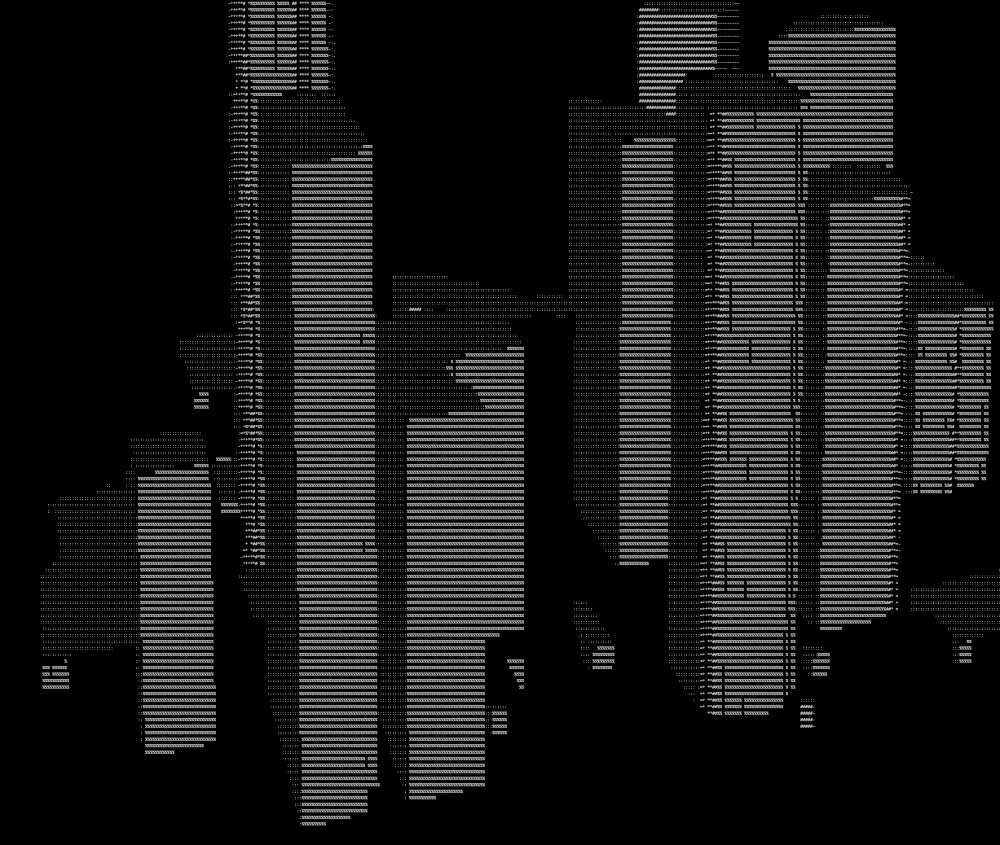

# ascii-city
**ascii-city** is a terminal-based 3D renderer that turns any address into a 3D ascii scene.

Currently only buildings are rendered. So locations with a lot of buildings create cool renders. Vice versa, locations in the nowhere will yield a blank screen.

## Installation
Clone the repository to your local machine:
```bash
git clone https://github.com/PaulWiench/ascii-city.git
cd ascii-city
```

The code is built with Python 3.12.5. It is recommended to setup a virtual environment to install the required packages:
```bash
python -m venv .venv
source .venv/bin/activate
```

Install the required packages inside the virtual environment:
```
pip install -r requirements.txt
```

## How to Run
```bash
python /path/to/main.py --location "401 S Hope St, Los Angeles" --radius 250
```

Flags:
- `-l, --location`: Specifies the location to render
- `-r, --radius`: Specifies the radius around the location to render (recommended values are 200 - 1000)

To achieve actually good looking renders the render canvas size is currently hardcoded to a very large value. To be able to see good results, you have to decrease the font size of your terminal emulator. For most emulators this can easily be done by pressing `ctrl -` or `ctrl shift -` a few times.

## Examples

**20 Pedder Street, Central, Hongkong**


**41 Kruis St, Johannesburg**


**401 S Hope St, Los Angeles**


## Attribution
This project relies on OSMs Overpass API and Nominatim API. So, huge thanks to the OSM contributors and the whole community!
- [Overpass API](https://overpass-api.de)
- [Nominatim API](https://nominatim.org)

Data © [OpenStreetMap](https://www.openstreetmap.org/copyright)
